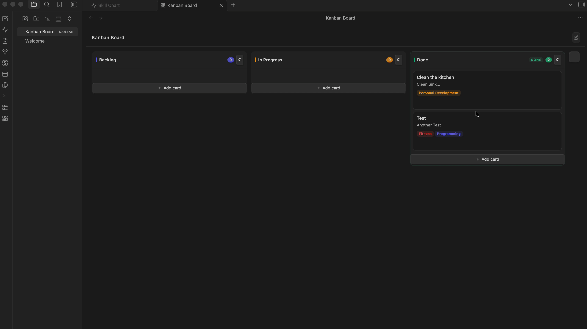

# Kanban Todo Board

[](https://github.com/jakobeilts/kanban-levelup-obsidian/releases/latest)
[](https://github.com/jakobeilts/kanban-levelup-obsidian/releases)
[](LICENSE)

Kanban boards for [Obsidian](https://obsidian.md), stored as plain files in your vault. Plan with an Eisenhower matrix, put a column in order with a priority duel, keep a log of everything you have finished, and watch a radar chart grow as you complete labelled work. Available in English and German.


---

## Why this plugin

Boards are `.kanban` files sitting in your vault next to your notes — plain JSON, versionable with git, syncable with whatever you already use, readable without the plugin. Nothing lives in a hidden database.

On top of the board there are three views that read from every board in the vault:

| View | What it does |
|---|---|
| **Eisenhower matrix** | Sort open tasks into urgent/important quadrants and work them off from there |
| **All done todos** | Every completed card across all boards, grouped by day |
| **Skill chart** | A radar chart that grows by one point per label each time you finish a labelled card |

Inside a board, any column can also be put in order with a [priority duel](#-priority-duel): pick the more important of two cards, again and again.

---

## Installation

> **Not in the community plugin list yet.** The plugin is awaiting review by the Obsidian team. Until it is listed, install it with **BRAT** (easiest, updates itself) or **manually** from a GitHub release. Both put the plugin in the same place, so you can switch between them later — and once the plugin is listed, the official install simply takes over.

### Option A: BRAT (recommended)

[BRAT](https://github.com/TfTHacker/obsidian42-brat) installs plugins straight from GitHub releases and keeps them up to date. Works on desktop and mobile.

1. Settings → Community plugins → turn off **Restricted mode** (if it is on)
2. **Browse** → search for **BRAT** → Install → Enable
3. Open the command palette (`Cmd/Ctrl + P`) → **BRAT: Add a beta plugin for testing**
4. Paste `jakobeilts/kanban-levelup-obsidian` and confirm
5. Settings → Community plugins → enable **Kanban Todo Board**

**Updating with BRAT:** BRAT checks for new releases when Obsidian starts (if *Auto-update plugins at startup* is on in the BRAT settings). To update right away: command palette → **BRAT: Check for updates to all beta plugins and UPDATE**, then reload Obsidian (`Cmd/Ctrl + P` → *Reload app without saving*).

### Option B: Manual install from a release

1. Open the [latest release](https://github.com/jakobeilts/kanban-levelup-obsidian/releases/latest) and download the three files **`main.js`**, **`manifest.json`** and **`styles.css`** (not the source code zip)
2. Open your vault folder and go to `.obsidian/plugins/`. Create the folder **`kanban-todo-board`** there if it does not exist
3. Put the three files **directly** into that folder:
   ```
   <YourVault>/.obsidian/plugins/kanban-todo-board/
   ├── main.js
   ├── manifest.json
   └── styles.css
   ```
4. In Obsidian: Settings → Community plugins → turn off **Restricted mode** → enable **Kanban Todo Board** (click the reload icon next to *Installed plugins* if it does not show up yet)

The `.obsidian` folder is hidden. On macOS press `Cmd + Shift + .` in Finder to show it; on Windows enable *Hidden items* in the Explorer *View* menu. Not sure where your vault is? In Obsidian, click the vault name in the bottom-left corner → *Manage vaults*.

From the terminal (macOS/Linux), with the three files in your Downloads folder:

```bash
VAULT="$HOME/path/to/YourVault"          # quotes matter if the path contains spaces
mkdir -p "$VAULT/.obsidian/plugins/kanban-todo-board"
cp ~/Downloads/{main.js,manifest.json,styles.css} "$VAULT/.obsidian/plugins/kanban-todo-board/"
```

### Updating from an older version

Already have an earlier version (for example 1.0.0)? Your boards and settings carry over — you only swap the program files.

**If you installed with BRAT:** see *Updating with BRAT* above.

**If you installed manually:**

1. Download `main.js`, `manifest.json` and `styles.css` from the [latest release](https://github.com/jakobeilts/kanban-levelup-obsidian/releases/latest)
2. Copy them into `<YourVault>/.obsidian/plugins/kanban-todo-board/` and **replace** the existing files
3. Reload Obsidian: `Cmd/Ctrl + P` → *Reload app without saving* (or turn the plugin off and on again under Community plugins)
4. Check the version under Settings → Community plugins → Kanban Todo Board

What to keep in mind:

- **Do not delete the plugin folder** to "start clean". Besides the three program files it contains `data.json` with your labels, skill chart scores and settings. Replace only the three files.
- **Your boards are safe either way.** They are the `.kanban` files in your vault, not part of the plugin folder.
- **Folder name must be `kanban-todo-board`.** If an older copy lives in a folder with another name (e.g. `kanban-levelup-obsidian`), Obsidian may list the plugin twice or load the old one. Copy `data.json` from the old folder into `kanban-todo-board`, then delete the old folder.
- **Switching from manual to BRAT** needs no clean-up: BRAT writes into the same `kanban-todo-board` folder and keeps `data.json`.
- **Going back to an older version** is safe: older versions simply ignore fields they do not know (such as Eisenhower categories or the duel order).

### What's new in 1.1.0

- **🧭 Eisenhower matrix** — sort open tasks into urgent/important quadrants; categories are stored per card
- **🥊 Priority duel** — order a column by picking the more important of two cards ([details](#-priority-duel))
- **🌐 German translation** — choose *Automatic*, English or Deutsch under Settings → Kanban Todo Board → Language
- Long columns scroll properly, and cards no longer shrink when a column fills up
- Description and author link in the plugin listing updated

### Troubleshooting

| Problem | Fix |
|---|---|
| Plugin does not appear under *Installed plugins* | The three files must sit directly in `kanban-todo-board/`, not in a sub-folder like `kanban-todo-board/kanban-todo-board-1.1.0/`. Then click the reload icon next to *Installed plugins* |
| New features are missing after an update | Obsidian still runs the old code: `Cmd/Ctrl + P` → *Reload app without saving*. Check the version number under Community plugins |
| `cp: … Not a directory` in the terminal | The vault path contains a space and is not in quotes — put the whole target path in `"…"` |
| Plugin is listed twice | An older copy exists under another folder name, see *Updating from an older version* |
| Something else | Open the developer console (`Cmd + Option + I` / `Ctrl + Shift + I`) and include the red error message in an [issue](https://github.com/jakobeilts/kanban-levelup-obsidian/issues) |

---

## Requirements

Obsidian 0.15.0 or newer. Works on desktop and mobile, though the card action buttons are revealed on hover and are therefore easier to reach with a pointer. *Automatic* language detection needs Obsidian 1.8.7 or newer; on older versions choose the language in the plugin settings.

---

## 📋 Kanban Board

### Creating a board
- Click the **dashboard ribbon icon** or run the command `New Kanban Board`
- Enter a name — a `.kanban` file is created in your vault root and opened immediately
- The board appears in your file list like any other note

### Columns
- **Add a column**: Click the `+` icon at the right edge of the board
- **Rename a column**: Double-click the column title to open the column settings
- **Delete a column**: Click the trash icon in the column header
- **Mark as Done**: In the column settings modal, toggle "Mark as Done column"

> ⚠️ **Important:** The "Done" status is set explicitly — it is NOT inferred from the column name. This means you can rename your Done column to anything (e.g. "🎉 Completed", "Shipped", "Archiv") without breaking Skill Chart or All Done Todos tracking.

### Cards
- **Add a card**: Click `+ Add card` at the bottom of any column
- **Edit a card**: Hover over a card → click the pencil icon
- **Delete a card**: Hover over a card → click the × icon
- **Move a card**: Drag and drop, or use the ◀ ▶ arrow buttons
- Cards support a **title**, optional **description**, one or more **labels**, and an optional **Eisenhower category**

### Auto-archive
Cards in Done columns that are **older than 7 days** are automatically hidden from the board view. They continue to count in the Skill Chart and appear on the All Done Todos page. A small note in the Done column shows how many items are archived.

---

## 🧭 Eisenhower Matrix

Open via the ribbon (grid icon) or command `Open eisenhower matrix`.

### What it shows
A 2×2 matrix of the **currently active board** — the board you last opened. Axes are *urgent / not urgent* (columns) and *important / not important* (rows):

| | Urgent | Not urgent |
|---|---|---|
| **Important** | **Do first** | **Schedule** |
| **Not important** | **Delegate** | **Eliminate** |

- Only **open** cards appear. Cards in a Done column are excluded — those belong to All Done Todos and the Skill Chart.
- Cards without a category collect in a **"Not categorised"** tray below the matrix.
- The board name is shown in a dropdown at the top; switching it also changes which board the matrix follows.

### Assigning a category
- **Drag & drop**: drag a card into any quadrant, or back into the tray to clear its category
- **Card dialog**: pick a category under "Eisenhower category" when creating or editing a card (on the board or in the matrix)
- The category shows as a colored chip on the Kanban card

### Working with cards
Cards show only their title, source column and labels. If a card has a description, a chevron appears to the left of the title — click anywhere on the card to expand it. Expanded cards stay expanded while the view is open.

Hovering a card reveals two buttons:

- **✓ Mark as done** — moves the card into the board's Done column, exactly as dragging it there would: it gets a completion timestamp, raises the Skill Chart for each of its labels, and appears in All Done Todos. If the board has no column marked as Done, a notice says so and nothing is moved.
- **✎ Edit** — opens the same card dialog as on the board

Changes are written straight into the board's `.kanban` file. If the board is open in a Kanban view, the change is routed through that view so both stay in sync.

---

## 🥊 Priority duel

Order a column by deciding between two cards at a time instead of dragging cards around.

Click the **swords icon** in a column header (not available in Done columns or with fewer than two cards). Two cards appear side by side — pick the one that should come first:

| Key | Action |
|---|---|
| `←` / `→` | Left / right card comes first |
| `↓` | Both are equally important |
| `Backspace` or `Z` | Undo the last duel |
| `S` | Skip this pair |
| `Enter` | Review the new order / apply it |

Not sure what a part of the dialog means? Click the small **?** next to its heading to expand an explanation.

### How the next pair is chosen
Each card gets a priority score (Bradley–Terry model). The **current column order counts as a starting point**, so with zero duels nothing changes and every duel only moves cards where you disagree with the existing order. The next pair is always the one whose outcome is expected to reveal the most about the order (information gain in bits).

Cards added to the column **since the last applied duel** start without that head start: they are placed in the middle with wide uncertainty, so the first duels go to finding their spot instead of making them climb up from the bottom one neighbour at a time.

### When to stop
- The **"Order settled" meter** fills once every card has been in a duel, new cards have had enough duels to find their spot, and the top of the list has kept its order for several duels in a row.
- The **information chart** shows the expected gain per duel and how many ranks each duel moved — when both flatten out, more duels are not worth it.
- The **current order** panel shows each card's score, its uncertainty and how far it moved compared to the column.

As a guide: a column that was already roughly in order usually settles after about half of *n·log₂n* duels (≈ 15 for 10 cards, ≈ 45–75 for 20). Columns of 30+ cards get tedious — consider duelling only the part you will work on soon.

### Nothing is written until you apply
The review screen shows the new order with ↑/↓ changes. **Apply** writes it into the column; **Discard** drops the duels. Closing the dialog with `Esc` keeps your duels in memory until Obsidian restarts, so reopening the same column resumes where you left off.

Applying also stores the resulting order in the column (`rankedIds` in the `.kanban` file). That is how the next duel recognises which cards are new.

---

## ✅ All Done Todos



Open via the ribbon (checkmark icon) or command `Open All Done Todos`.

- Aggregates **all completed cards** from all `.kanban` files in your vault
- Shows the **completion date and time** for each card
- Grouped by day, sorted newest first
- Displays the **board name** each card belongs to
- Shows assigned **labels**

Cards are tracked here regardless of whether they are still visible on the Kanban board or have been auto-archived.

---

## 📡 Skill Chart


Open via the ribbon (activity icon) or command `Open Skill Chart`.

### How it works
Every time a card is moved into a **Done column**, the Skill Chart increments by 1 for each label on that card. Moving the card back out decrements it. The chart grows over time as you complete labeled work.

### Radar chart
- One axis per label defined in settings
- The shape shows the distribution of your completed work across label types
- Long label names wrap automatically and are never clipped

### Comparison / history
The plugin takes automatic snapshots of your scores (at most once per 20 hours). You can compare your current chart against any past point:

- **Quick presets**: 1W, 2W, 1M, 3M, 6M — sets the comparison range to that many days ago
- **Custom date range**: Set a "From" and "To" date manually using the date pickers
- **Toggle**: Disable comparison entirely with the toggle switch
- The dashed polygon on the chart shows your skills at the start of the selected period
- The stats grid shows the delta (e.g. `+3`) per label

---

## 🏷 Labels

Manage labels in **Settings → Kanban Todo Board → Labels**:

- **Add** labels with `+ Add label`
- **Rename** labels inline — changes reflect immediately on all open boards
- **Change color** using the color picker — the label preview updates live
- **Delete** labels (note: cards retain the label ID, so re-adding a label with the same name won't reconnect them)

Labels assigned to a card are shown as color-coded chips on the card. They drive the Skill Chart axes.

---

## ⚙️ Settings

| Setting | Description |
|---|---|
| **Language** | *Automatic* (follows Obsidian's language), English or German. Command names and ribbon tooltips switch after reloading Obsidian |
| **Labels** | Add, rename, recolor, and delete labels |
| **Reset skill scores** | Wipes all accumulated Skill Chart scores and snapshot history |

> Eisenhower categories are stored per card inside the `.kanban` file, not in the plugin settings. Existing boards keep working — cards without a category simply start in the "Not categorised" tray.

---

## 📁 File structure

```
kanban-levelup-obsidian/
├── main.ts                 # Plugin logic: board, views, modals, settings (TypeScript source)
├── duel-ranker.ts          # Priority duel: ranking model and pair selection (no Obsidian imports, testable in Node)
├── duel-modal.ts           # Priority duel: the duel / review dialog
├── i18n.ts                 # All UI texts in English and German; add a language by adding a dictionary
├── main.js                 # Bundled output — this is what Obsidian loads
├── styles.css              # Styles (uses Obsidian CSS variables — adapts to any theme)
├── manifest.json           # Plugin metadata
├── versions.json           # Plugin version → minimum Obsidian version
├── esbuild.config.mjs      # Build config
├── version-bump.mjs        # Keeps manifest/versions in step with `npm version`
├── scripts/seed-board.mjs  # Development helper: generates a board full of test data
└── .github/workflows/release.yml  # Builds and publishes a release on tag push
```

Board data is stored in `.kanban` files in your vault (plain JSON).  
Label definitions and Skill Chart scores are stored in `.obsidian/plugins/kanban-todo-board/data.json`.

---

## 💻 Development

Requires [Node.js](https://nodejs.org/) 16 or newer.

```bash
git clone https://github.com/jakobeilts/kanban-levelup-obsidian.git
cd kanban-levelup-obsidian
npm install

npm run dev     # Watch mode — rebuilds on file changes
npm run build   # Type-check with tsc, then bundle with esbuild
```

To try a build in Obsidian, copy `main.js`, `manifest.json` and `styles.css` into
`<YourVault>/.obsidian/plugins/kanban-todo-board/` and reload the app. Developing directly
inside a vault's plugin folder works too — `npm run dev` then rebuilds in place.

### Test data

`scripts/seed-board.mjs` writes a `.kanban` file full of generated cards into a vault, so the board and the Eisenhower matrix can be checked with realistic amounts of content. It is a development helper only — it is not bundled into `main.js` and never reaches users.

```bash
npm run seed -- --vault ~/Documents/Obsidian/Vaults/<YourVault>
npm run seed -- --vault <path> --cards 200 --name "Stress test" --force
npm run seed -- --vault <path> --sparse   # leaves two quadrants empty
```

| Option | Meaning |
|---|---|
| `--vault <path>` | Vault root. Falls back to `$KANBAN_TEST_VAULT` |
| `--name <name>` | Board file name without extension. Default `Test board` |
| `--cards <n>` | Roughly how many cards. Default 60 |
| `--sparse` | Leaves "Delegate" and "Eliminate" empty, to check empty states |
| `--force` | Overwrite an existing board file |

The generated board covers all four quadrants, uncategorised cards, a Done column with completion dates spread over 14 days (so both visible and auto-archived cards appear), and a handful of layout edge cases: an overlong title with an unbreakable word, a card carrying every label, one with neither label nor description, and emoji/special characters.

Two caveats:

- Labels are read from the plugin's `data.json`. If the plugin has never been enabled in that vault, the file does not exist yet and cards are generated without labels — enable the plugin once, then re-run.
- Skill chart scores are event-driven: they are written when a card is *moved* into a Done column at runtime. Seeded Done cards therefore appear in All Done Todos but do not raise the chart.


---

## 🚀 Releasing

Releases are built and published by `.github/workflows/release.yml` when a version tag is pushed.
Obsidian looks for a tag that matches `manifest.json` exactly, so tags carry **no `v` prefix**.

```bash
npm version minor        # bumps package.json, manifest.json and versions.json, commits, tags
git push && git push --tags
```

`npm version` runs `version-bump.mjs`, which writes the new version into `manifest.json` and adds a
`versions.json` entry mapping it to the current `minAppVersion`. The workflow then type-checks,
builds, verifies that the tag and the manifest agree, and attaches `main.js`, `manifest.json` and
`styles.css` to the release as individual files — which is the layout Obsidian's installer expects.

---

## 🤝 Contributing

Bug reports and feature requests are welcome in the
[issue tracker](https://github.com/jakobeilts/kanban-levelup-obsidian/issues). For pull requests,
please run `npm run build` first — it type-checks as well as bundles — and describe what you changed
and how you tested it.

---

## 📄 License

[MIT](LICENSE) © Jakob Eilts
